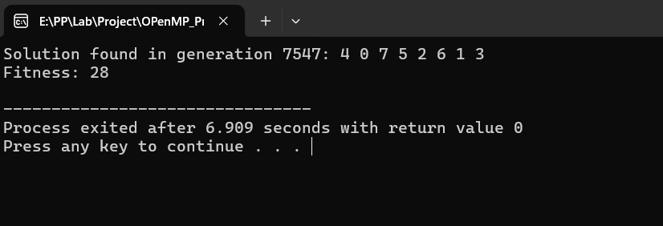

# Parallel-Programming-Projects

This repository contains four projects developed as part of our college coursework in parallel programming.

## Table of Contents
1. [Genetic Algorithm for N-Queens Problem](#genetic-algorithm-for-n-queens-problem)
2. [Project 2: Project Title](#project-2-project-title)
3. [Project 3: Project Title](#project-3-project-title)
4. [Project 4: Project Title](#project-4-project-title)

## Genetic Algorithm for N-Queens Problem

### Description
This project implements a genetic algorithm to solve the N-Queens problem using parallel programming with OpenMP. The goal is to find a solution where 8 queens can be placed on a chessboard without attacking each other.

### Features
- Genetic Algorithm implementation
- Parallel initialization and evolution using OpenMP
- Fitness calculation based on non-attacking pairs of queens
- Crossover and mutation operations for generating new populations

### Installation and Usage
To compile and run the program, you need a C++ compiler with OpenMP support. Follow the steps below:

1. Clone the repository:
    ```bash
    git clone https://github.com/yourusername/parallel-programming-project.git
    cd parallel-programming-project
    ```

2. Navigate to the project directory:
    ```bash
    cd genetic-algorithm
    ```

3. Compile the program:
    ```bash
    g++ -fopenmp -o genetic_algorithm genetic_algorithm.cpp
    ```

4. Run the program:
    ```bash
    ./genetic_algorithm
    ```

### Code Snippets
Here is a brief code snippet from the project:

```cpp
struct Individual {
    std::vector<int> chromosome;
    int fitness;

    Individual() : fitness(0) {
        chromosome.resize(BOARD_SIZE);
    }
};

// Initialize a random individual
void initializeIndividual(Individual& individual) {
    for (int i = 0; i < BOARD_SIZE; ++i) {
        individual.chromosome[i] = std::rand() % BOARD_SIZE;
    }
}

// Calculate fitness
int calculateFitness(const Individual& individual) {
    int clashes = 0;
    for (int i = 0; i < BOARD_SIZE; ++i) {
        for (int j = i + 1; j < BOARD_SIZE; ++j) {
            if (individual.chromosome[i] == individual.chromosome[j] || 
                abs(individual.chromosome[i] - individual.chromosome[j]) == j - i) {
                clashes++;
            }
        }
    }
    return 28 - clashes; // 28 is the max number of non-attacking pairs
}
```

### ScreenShot
Here is a screenshot of the program output:


## MPI Temperature Simulation

### Description
This project simulates the diffusion of temperature across a linear grid using MPI for parallel processing. Each process handles a segment of the grid and exchanges boundary information with its neighbors to simulate the diffusion process.

### Features
- MPI-based parallel simulation
- Boundary condition handling with MPI_Sendrecv
- Periodic summary statistics gathered and printed by the root process

### Installation and Usage
To compile and run the program, you need a C++ compiler with OpenMP support. Follow the steps below:

1. Clone the repository:
    ```bash
    git clone https://github.com/yourusername/parallel-programming-project.git
    cd parallel-programming-project
    ```

2. Navigate to the project directory:
    ```bash
    cd mpi-temperature-simulation
    ```

3. Compile the program:
    ```bash
    mpic++ -o mpi_simulation mpi_simulation.cpp

    ```

4. Run the program:
    ```bash
    mpirun -np <number_of_processes> ./mpi_simulation
    ```

### Code Snippets
Here is a brief code snippet from the project:

```cpp
void simulate_step(std::vector<float>& local_grid, float left_neighbor, float right_neighbor) {
    std::vector<float> new_local_grid = local_grid;
    for (size_t i = 0; i < local_grid.size(); ++i) {
        float left_temp = (i == 0) ? left_neighbor : local_grid[i - 1];
        float right_temp = (i == local_grid.size() - 1) ? right_neighbor : local_grid[i + 1];
        new_local_grid[i] = (local_grid[i] + left_temp + right_temp) / 3.0f;
    }
    local_grid.swap(new_local_grid); // Efficiently update local_grid with the contents of new_local_grid
}

// Function to print summary statistics
void print_summary(int timestep, const std::vector<float>& global_grid) {
    float min_temp = *std::min_element(global_grid.begin(), global_grid.end());
    float max_temp = *std::max_element(global_grid.begin(), global_grid.end());
    float average_temp = std::accumulate(global_grid.begin(), global_grid.end(), 0.0f) / global_grid.size();

    std::cout << "Timestep " << timestep << " Summary:\n";
    std::cout << "  Average Temperature: " << average_temp << " degrees\n";
    std::cout << "  Minimum Temperature: " << min_temp << " degrees\n";
    std::cout << "  Maximum Temperature: " << max_temp << " degrees\n";
    std::cout << "------------------------------------------\n";
}

```
